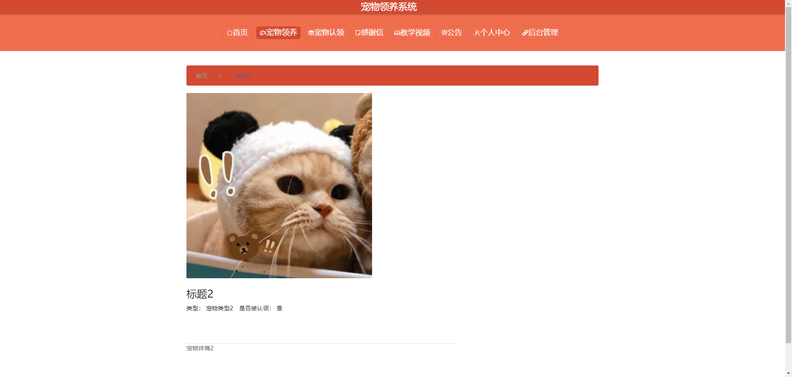
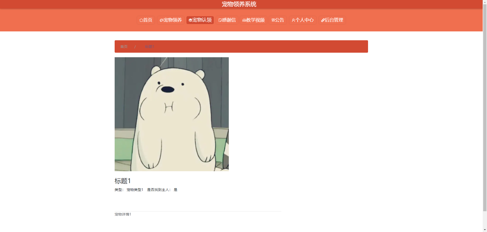
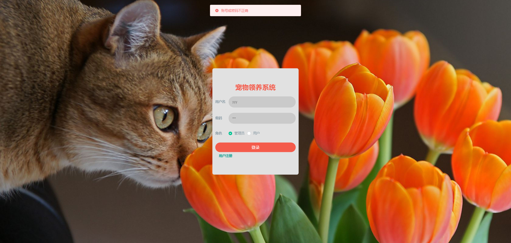
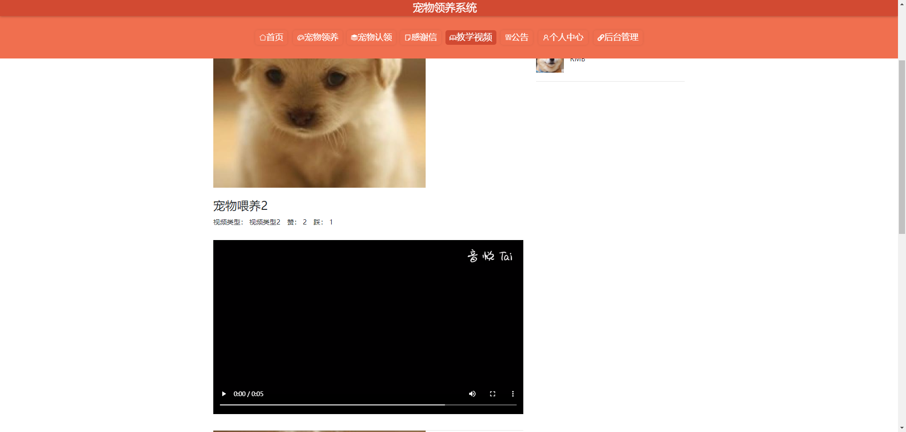
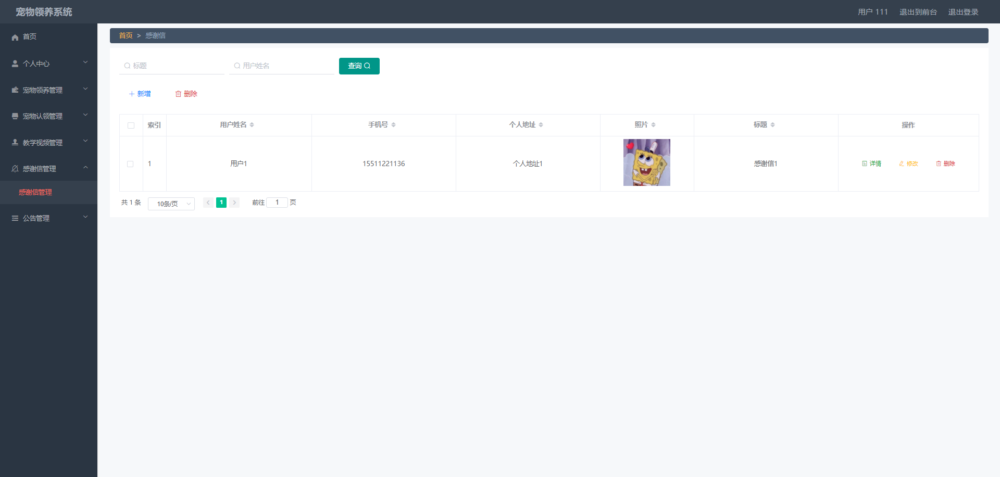
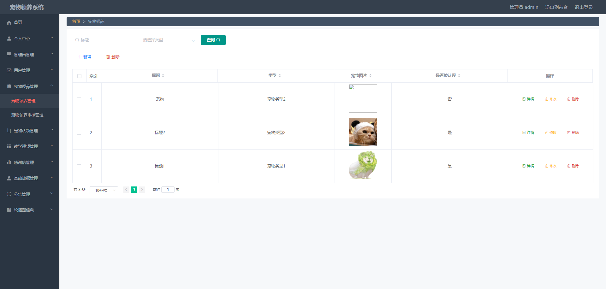
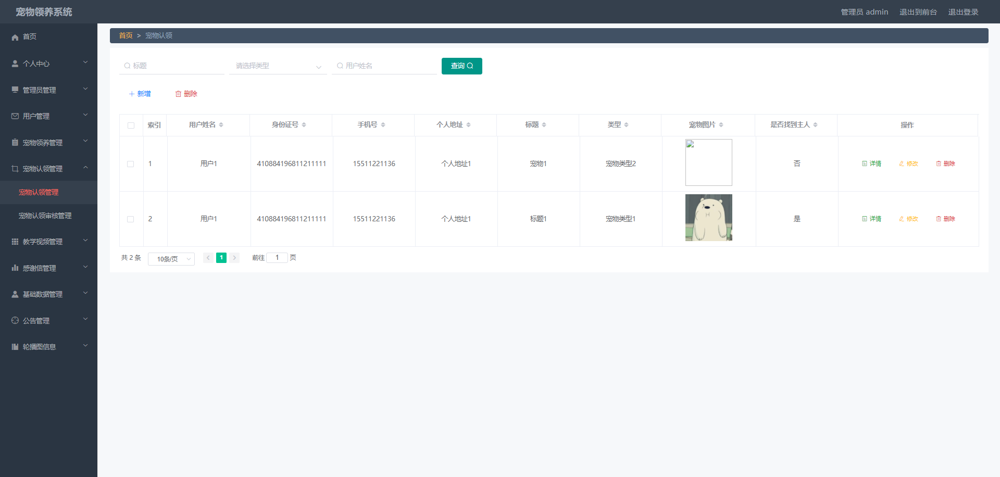
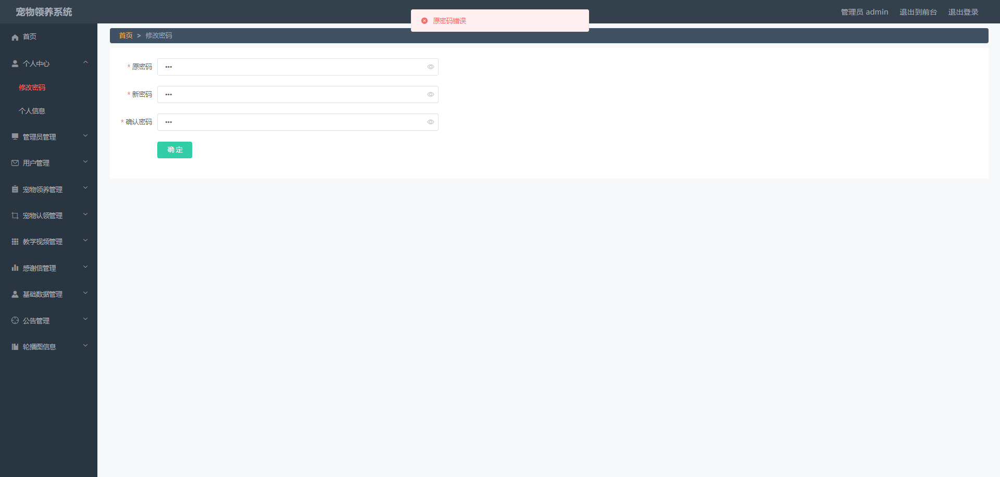
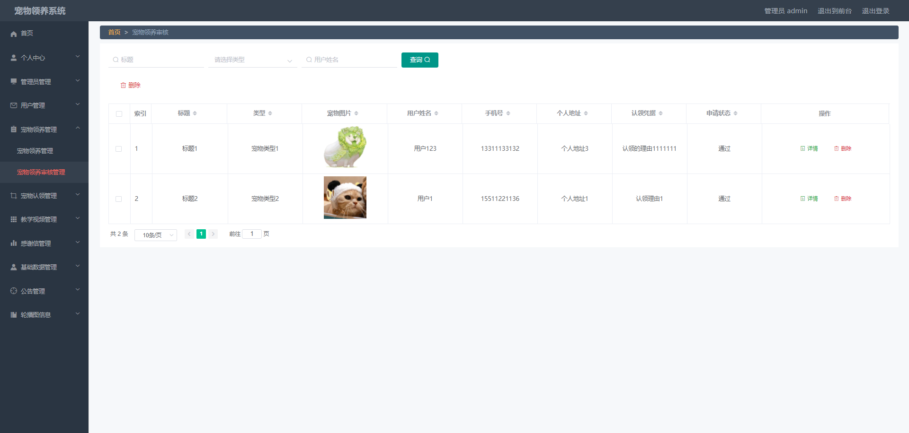

# 基于SpringBoot的宠物领养系统设计与实现

#### 介绍
基于SpringBoot+Vue的宠物领养系统设计与实现；本项目包含：源码+数据库sql+开题报告+论文+说明文档
本项目可以用于毕业设计，白嫖勿扰！
全网毕业设计项目这里都有
更多项目源码可以私信联系：微信 -- 13283346760

#### 获取源码
微信 -- 13283346760

备注项目名称

#### 课题背景
二十一世纪互联网的出现，改变了几千年以来人们的生活，不仅仅是生活物资的丰富，还有精神层次的丰富。时代进步的标志，就是让人们过上更好的生活。在互联网诞生之前，地域位置往往是人们思想上不可跨域的鸿沟，信息的传播速度极慢，信息处理的速度和要求还是通过人们骑马或者是信鸽传递，这些信息传递都是不可控制的，中间很有可能丢失，信息的传递水平决定了人们生活的水平。现如今，大家都在用互联网来实现自己的目的，从内部管理设置计算机管理，提高内部信息管理水平，从外部市场也可以用计算机获取相关数据进行处理，如今各行各业已经严重依赖于计算机了。
本课题研究和开发宠物领养系统，让安装在计算机上的该系统变成管理人员的小帮手，提高宠物领养信息处理速度，规范宠物领养信息处理流程，让管理人员的产出效益更高。

#### 软件架构
开发环境：JDK8、SpringBoot、Maven、MySQL、Vue

#### 安装教程

1.  下载IDEA集成开发工具
2.  配置Maven环境
3.  启动项目

#### 项目运行截图
##### 用户端
宠物领养界面

宠物认领界面

登录注册界面

教学视频界面

##### 管理端
感谢信管理界面

宠物领养管理界面

宠物认领管理界面

修改用户名密码界面

宠物领养审核界面

